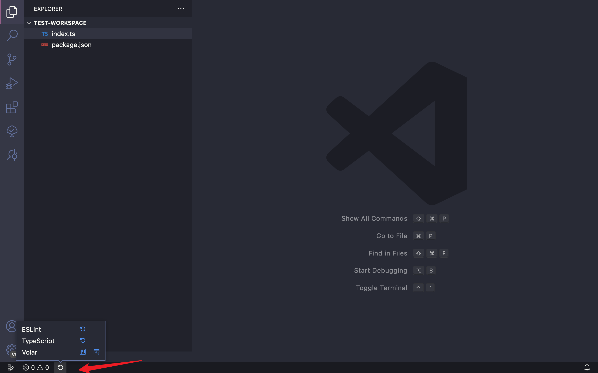

# Reload Can Solve Any Problems

    

   

## Features

- highly customizable status bar to reload vscode and extensions
- reload window shortcut <kbd>⌘</kbd>+<kbd>R</kbd>

## My extensions

- [Open in External App](https://github.com/tjx666/open-in-external-app)
- [Package Manager Enhancer](https://github.com/tjx666/package-manager-enhancer)
- [Neo File Utils](https://github.com/tjx666/vscode-neo-file-utils)
- [VSCode FE Helper](https://github.com/tjx666/vscode-fe-helper)
- [VSCode archive](https://github.com/tjx666/vscode-archive)
- [Better Colorizer](https://github.com/tjx666/better-colorizer/tree/main)
- [Modify File Warning](https://github.com/tjx666/modify-file-warning)
- [Power Edit](https://github.com/tjx666/power-edit)
- [Adobe Extension Development Tools](https://github.com/tjx666/vscode-adobe-extension-devtools)
- [Scripting Listener](https://github.com/tjx666/scripting-listener)

Check all here: [publishers/YuTengjing](https://marketplace.visualstudio.com/publishers/YuTengjing)
